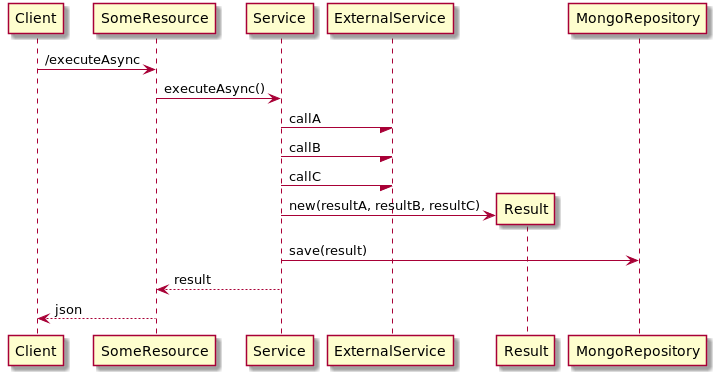

# Kotlin Coroutine Benchmark

## Description
This is simple benchmark to compare kotlin coroutine rest service against non-coroutine one.
It also serves as a SpringBoot Coroutine sample application.

## Objectives
The main focus here is compare nonblocking coroutines and thread-pre-request approaches. So im not worried about the throughput i can get, the endpoint under test is very simple, i wanna just compare the results with and without coroutines.

## Endpoint under test
The service under test is very simple. It simulates a service that does 3 GETs, simulating 3 others restful micro-services returning json, create a new object composed by this 3 jsons, save it in a mongodb collections and return it to the client.

The goal is simulate a endpoint with some IOs and a little of CPU usage

The endpoint has two methods /execute and /executeAsync, the only differences is that
/executeAsync does the GETs to external service in parallel and /execute does in sequencial.

#### /execute - Non parallel calls


#### /executeAsync - parallel calls



## Running

### Start local mongodb

```
$ cd kotlin-coroutine-benchmark/docker
$ docker-compose up
```

### Start NonCoroutine application

```
$ cd kotlin-coroutine-benchmark/noncoroutineapp
$ ./gradlew bootRun
```

### Start Coroutine application

```
$ cd kotlin-coroutine-benchmark/coroutineapp
$ ./gradlew bootRun
```

## Considerations
This benchmarch was executed in my machine with jmeter, springboot app and mongodb running local 
and the endpoint simulating a external service was on http://mocky.io site. 

My machine is a intel core i7 8th and 4 cores with 16mb of RAM.

## JMeter Test

| Paramter          | Value      |
|-------------------|------------|
| Concurrent users  | 20         |
| Loop count        | 10         |
| Time beween calls | 300ms      |


## Results 

### General Summary

| Scenario                                 | Thoughtput |   Time  |                                      |
|------------------------------------------|------------|---------|--------------------------------------|
| /executeAsync Coroutine 128MB of memory   | 32.5/sec  |  6 secs |[details](#executeAsync-Coroutine-128MB-of-memory)  |
| /executeAsync Coroutine 64MB of memory    | 24.4/sec  |  8 secs |[details](#executeAsync Coroutine 64MB of memory) |
| /executeAsync NonCoroutine 128MB of memory| 21.2/sec  |  9 secs |[details](#executeAsync-NonCoroutine)                                      |
| /executeAsync NonCoroutine 64MB of memory | 21.1/sec  |  9 secs |                                      |
| /execute Coroutine 128MB of memory        | 15.9/sec  | 12 secs |                                      |
| /execute NonCoroutine 128MB of memory     | 15.0/sec  | 13 secs |                                      |
| /execute Coroutine 64MB of memory         | 15.1/sec  | 13 secs |                                      |
| /execute NonCoroutine 64MB of memory      |  8.1/sec  | 25 secs |                                      |

### Testing with 128MB of ram

#### /execute NonCoroutine 128MB of memory

| Meter            | Value      |
|------------------|------------|
| Time to complete | 13 seconds |
| Thoughtput       | 15/sec     |


##### JVM Monitor


##### JMeter Summary


#### /executeAsync NonCoroutine 128MB of memory <a name="executeAsync-NonCoroutine"></a>

| Meter            | Value      |
|------------------|------------|
| Time to complete |  9 seconds |
| Thoughtput       |   21.2/sec |


##### JVM Monitor


##### JMeter Summary


#### /execute Coroutine 128MB of memory

| Meter            | Value      |
|------------------|------------|
| Time to complete | 12 seconds |
| Thoughtput       | 15.9/sec   |


##### JVM Monitor


##### JMeter Summary


#### /executeAsync Coroutine 128MB of memory <a name="executeAsync-Coroutine-128MB-of-memory">

| Meter            | Value      |
|------------------|------------|
| Time to complete | 6 seconds  |
| Thoughtput       | 32.5/sec   |


##### JVM Monitor


##### JMeter Summary


### Testing with 64MB of ram

#### /execute NonCoroutine 64MB of memory

| Meter            | Value      |
|------------------|------------|
| Time to complete | 25 seconds |
| Thoughtput       | 8.1/sec     |


##### JVM Monitor


##### JMeter Summary


#### /executeAsync NonCoroutine 64MB of memory

| Meter            | Value      |
|------------------|------------|
| Time to complete | 9 seconds  |
| Thoughtput       | 21.1/sec   |


##### JVM Monitor


##### JMeter Summary


#### /execute Coroutine 64MB of memory

| Meter            | Value      |
|------------------|------------|
| Time to complete | 13 seconds |
| Thoughtput       | 15.1/sec   |


##### JVM Monitor


##### JMeter Summary


#### /executeAsync Coroutine 64MB of memory - Parallel

| Meter            | Value      |
|------------------|------------|
| Time to complete | 8 seconds  |
| Thoughtput       | 24.4/sec   |


##### JVM Monitor


##### JMeter Summary


