# Kotlin Coroutine Benchmark

## Description
Simple benchmark to compare kotlin coroutine rest service against non-coroutine one.

## Objectives
The main focus here is compare nonblocking coroutines and thread-pre-request approaches. So im not worried about the throughput i can get, the endpoint under test is very simple, i wanna just compare the results with and without coroutines.

## Endpoint under test
The service under test is very simple. It simulates a service that does 3 GETs, simulating 3 others restful micro-services returning json, create a new object composed by this 3 jsons, save it in a mongodb collections and return it to the client.

The goal is simulate a endpoint with some IOs and a little of CPU usage

The endpoint has two methods /execute and /executeAsync, the only differences is that
/executeAsync does the GETs to external service in parallel and /execute does in sequencial.

#### /execute - Non parallel calls

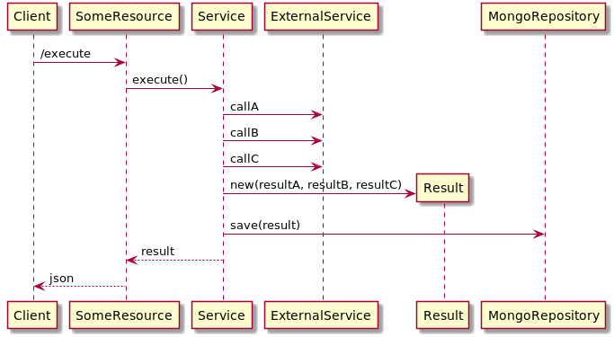

#### /executeAsync - parallel calls

## JMeter Test

| Paramter          | Value      |
|-------------------|------------|
| Concurrent users  | 20         |
| Loop count        | 10         |
| Time beween calls | 300ms      |

## Results 

### General Summary
| Scenario                                | Thoughtput |   Time  |
|-----------------------------------------|------------|---------|
| Coroutine 128MB of memory - parallel    | 29.6/sec   |  7 secs |
| Coroutine 64MB of memory - parallel     | 28.8/sec   |  7 secs |
| Coroutine 64MB of memory                | 17.2/sec   | 12 secs |
| Coroutine 128MB of memory               | 15.9/sec   | 12 secs |
| NonCoroutine 128MB of memory            | 15.0/sec   | 13 secs |
| NonCoroutine 64MB of memory             |  8.1/sec   | 25 secs |
| NonCoroutine 128MB of memory - parallel |  7.1/sec   | 28 secs |
| NonCoroutine 64MB of memory - parallel  |  5.6/sec   | 35 secs |

### NonCoroutine 128MB of memory

| Meter            | Value      |
|------------------|------------|
| Time to complete | 13 seconds |
| Thoughtput       | 15/sec     |

#### JVM Monitor

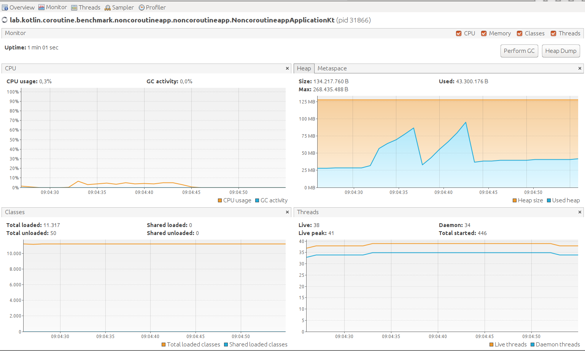

#### JMeter Summary

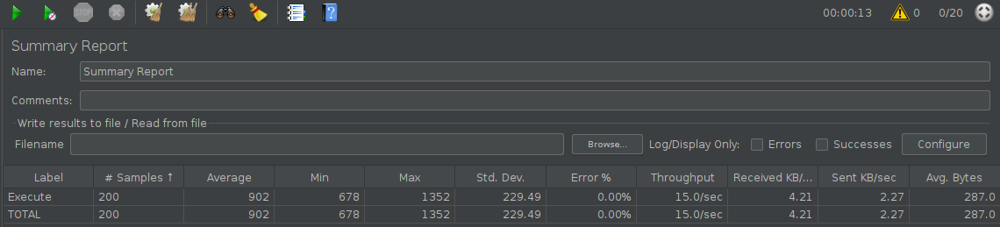

### NonCoroutine 128MB of memory - Parallel Calls

| Meter            | Value      |
|------------------|------------|
| Time to complete | 28 seconds |
| Thoughtput       | 7.1/sec     |

#### JVM Monitor

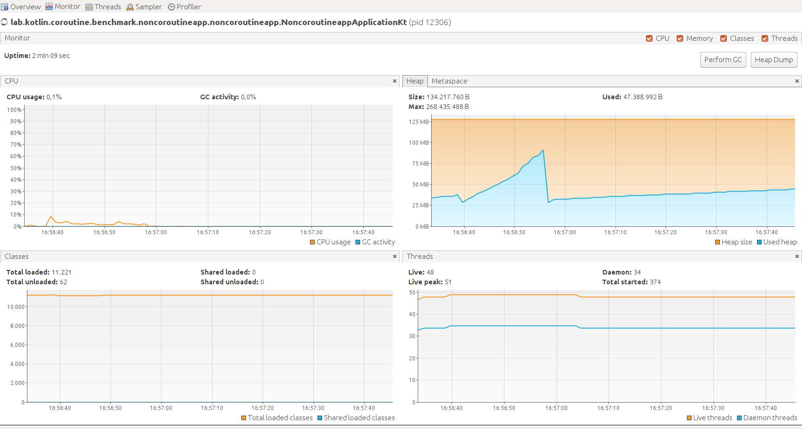

#### JMeter Summary

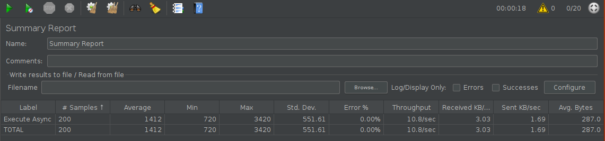

### Coroutine 128MB of memory

| Meter            | Value      |
|------------------|------------|
| Time to complete | 12 seconds |
| Thoughtput       | 15.9/sec     |

#### JVM Monitor

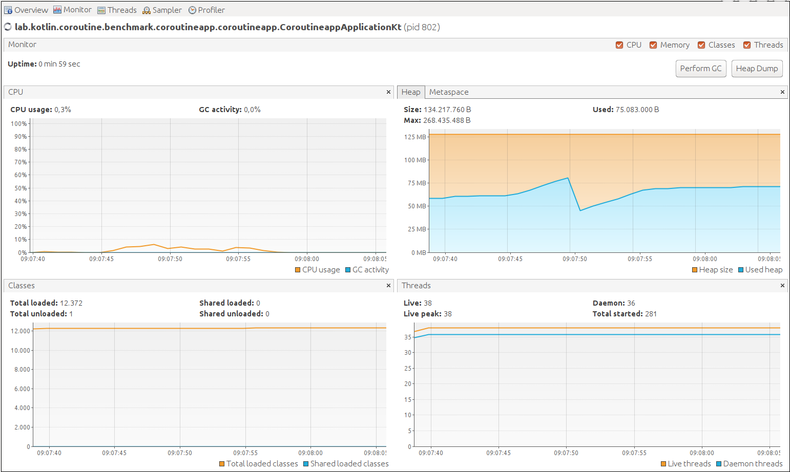

#### JMeter Summary

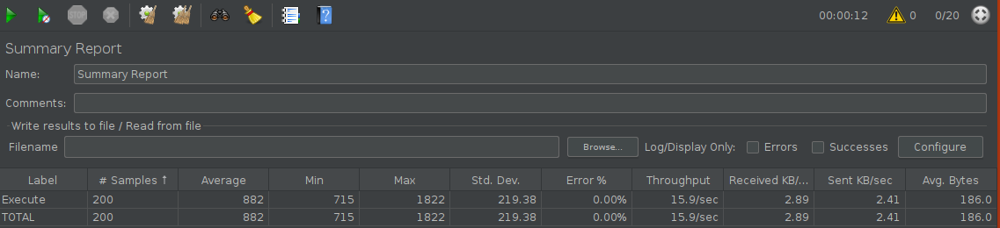

### Coroutine 128MB of memory - Parallel

| Meter            | Value      |
|------------------|------------|
| Time to complete | 7 seconds |
| Thoughtput       | 29.6/sec     |

#### JVM Monitor

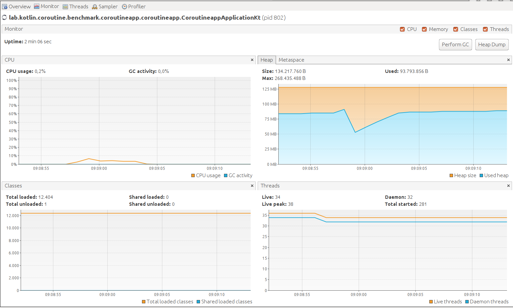

#### JMeter Summary

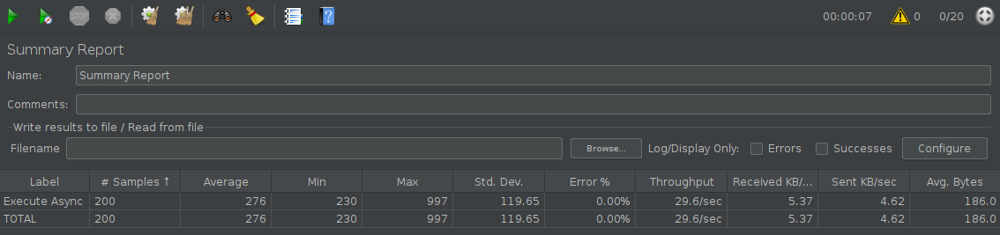

### NonCoroutine 64MB of memory

| Meter            | Value      |
|------------------|------------|
| Time to complete | 25 seconds |
| Thoughtput       | 8.1/sec     |

#### JVM Monitor

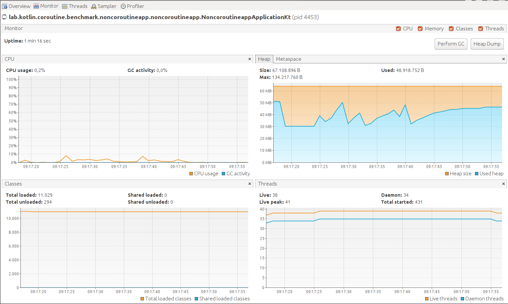

#### JMeter Summary

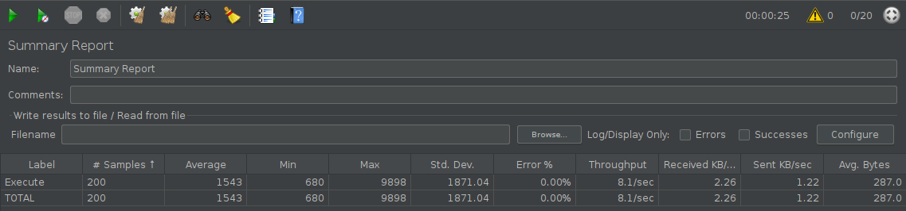

### NonCoroutine 64MB of memory - Parallel

| Meter            | Value      |
|------------------|------------|
| Time to complete | 35 seconds |
| Thoughtput       | 5.6/sec     |

#### JVM Monitor

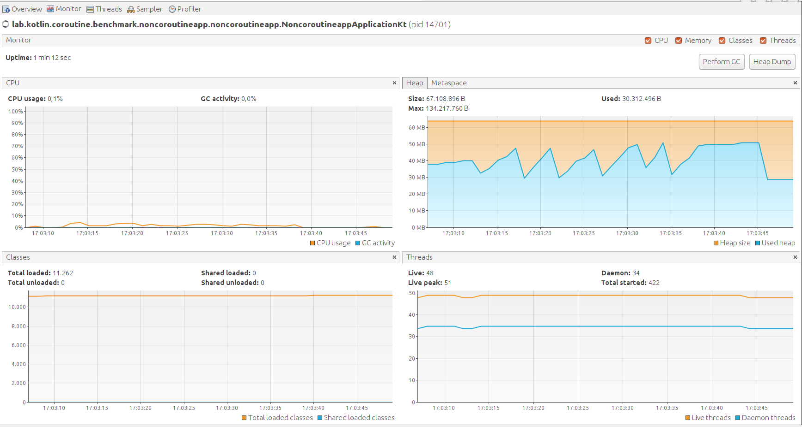

#### JMeter Summary

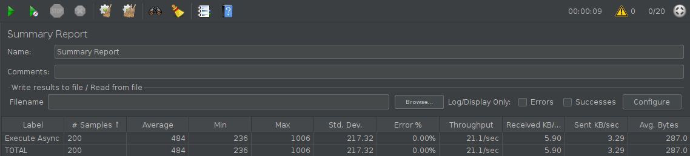

### Coroutine 64MB of memory

| Meter            | Value      |
|------------------|------------|
| Time to complete | 12 seconds |
| Thoughtput       | 17.2/sec     |

#### JVM Monitor

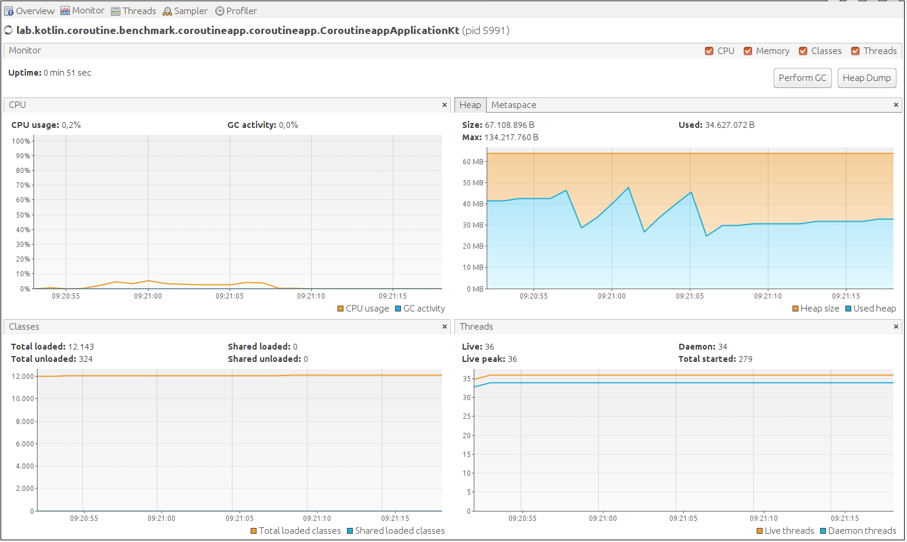

#### JMeter Summary

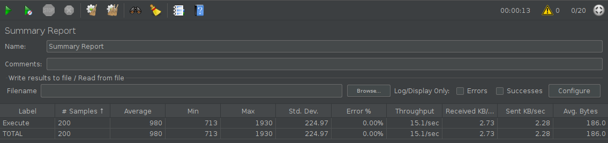

### Coroutine 64MB of memory - Parallel

| Meter            | Value      |
|------------------|------------|
| Time to complete | 7 seconds |
| Thoughtput       | 28.8/sec     |

#### JVM Monitor

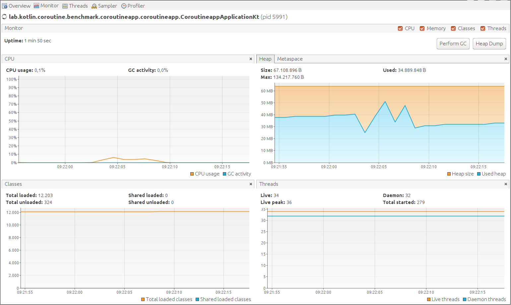

#### JMeter Summary

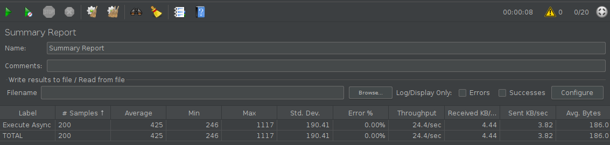

